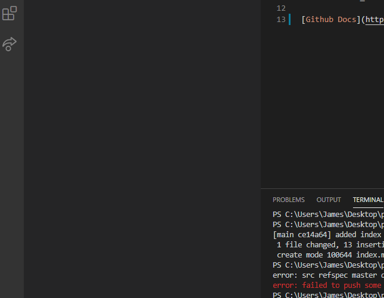

# Large heading
## Smaller Heading
### Even Smaller Heading
#### Significantly Smaller Heading
##### Even Significantly Smaller Heading
###### Smallest Heading

**Bold Text**\
*Italic Text*\
~~Mistsake~~\
**_Italic_ within Bold**\
***Italic and Bold***\

> Fun Quote

Commands: `cd`, `ls`, `whoami`

[Github Docs](https://docs.github.com/en/free-pro-team@latest/github/writing-on-github/basic-writing-and-formatting-syntax)\
[Smaller Heading Link](#smaller-heading)\
[README link](README.md)\

- Top
- Mid
- Bot
- Jg
- Supp

1. First
2. Second
3. Third

4. List
   - Nest
     - Nest Nest

Random Screenshot\

- [x] Do the dishes
- [ ] Do laundry
- [ ] \(Take the trash out
- [ ] :sunglasses: :confused: :anguished: :sparkling_heart: :right_anger_bubble: